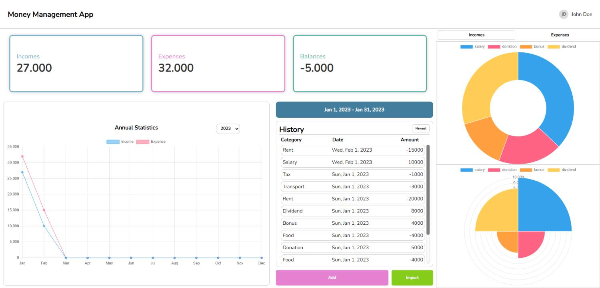

# Mustache Money Management

## ⌛Overview
This web application is designed to help users manage their finances effectively. It provides a user-friendly interface for tracking income and expenses. The application uses the Mustache template engine along with Express.js for server-side logic and dynamic rendering of HTML content.

## 🎆Technologies Used
- **Express.js:** A web application framework for Node.js used for server-side operations.
- **Mustache-Express:** A logic-less template syntax used for rendering HTML pages on the client side.
- **HTML, CSS, JavaScript:** Standard web technologies for building the user interface and functionality.

## 🏠Getting Started

- Clone the repository
```bash
git clone https://github.com/Yadija/mustache-money-management.git
cd mustache-money-management
```
## 🚀Installation
- Install dependencies
  - `npm install`


## 🔭Running App
- Running
  - `npm start`
  - Open your web browser and navigate to http://localhost:3000 (or the specified port).

## 🔍Picture
